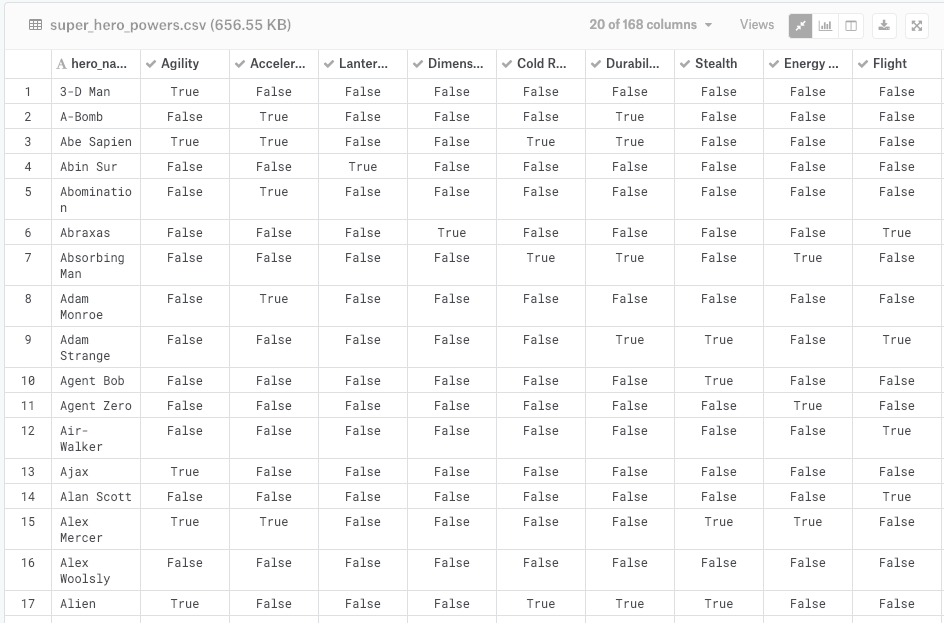
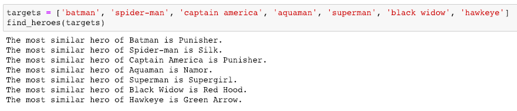
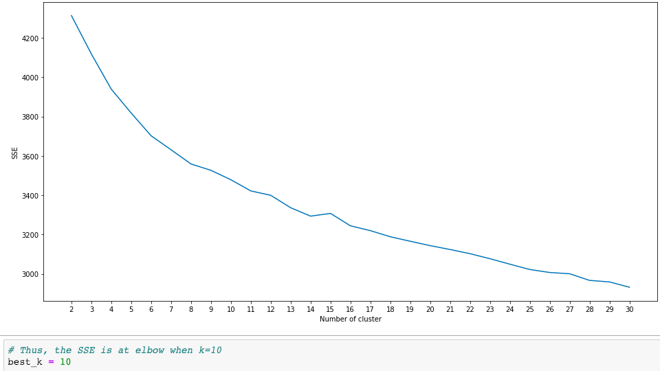
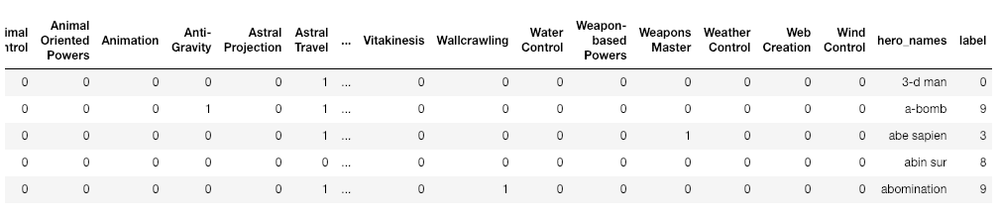
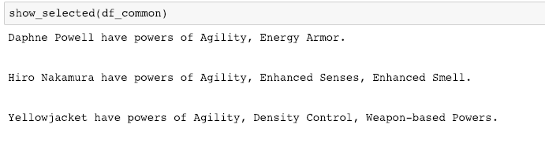
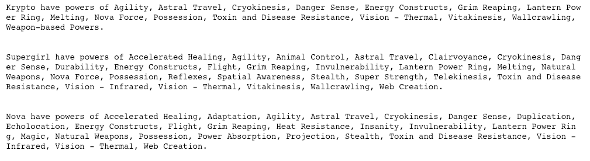
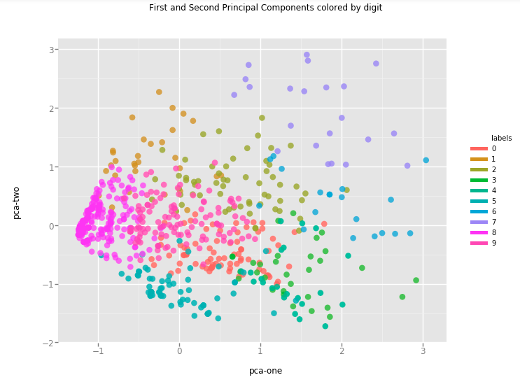
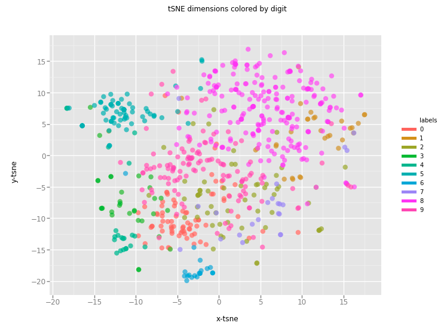

# Super_Hero_Clustering
## Introduction
This project is to distribute comic super heroes into different clusters based on their abilities using machine learning. It can be divided into two parts.  
* Part 1: Using cosine similarity to find out the most similar hero for the input one based on the abilities.  
* Part 2: Clustering heroes into different groups by KMeans method.  

## Data  
**Data Source:**  
https://www.kaggle.com/claudiodavi/superhero-set#super_hero_powers.csv  
This data was scraped from <a href='https://www.superherodb.com/'>SuperHeroDb</a> and was collected in June/2017 from superherodb which  had not been updated since, so it may not be up to date.  

Data example:  
  

Data summary:  
668 x 168  (668 heroes and 168 types of abilities)  

**Although the columns are already in one-hot style, the values are 'True/False' in String, which need to be converted into 1 or 0 for the convenience of future analysis.**  

## Methodology  
**I.  Data preprocessing**  
1. Load data from CSV file and convert column's value from 'False/True' <String> to appropriate 0/1 <Int> for the convenience of following analysis.  
2. The converted column data is useful for:
  * A python dictionary pairing with hero's name as key for the similarity search.
  * A numpy vector for KMeans clustering.
  * A pandas dataframe with header for ggplot visualization.  
All three data sets were created as described above.  
  
**II. Data Analysis**  

**PART 1. Similarity Search**  
By comparing cosine similarity of the one-hot data for hero's ability among the data set, we can find out the hero with the highest similarity to the input one. For example:  
  
**PART 2. Clustering heroes**  
1. Since the proper clustering number k is required for the modeling, a plot was created with the Sum of Squared Error (SSE) against a range of k (2 to 30) to find out the elbow value of k. In this project, it took k=10 (Fig.1).  
Fig.1:   
2. Cluster the data set with the proper k (k=10) and add the predicted label to the data frame (Fig.2).  
Fig.2:   
3. Visualize the clustering by two differnet methods:  
* Principal Component Analysis (PCA);  
* t-Distributed Stochastic Neighbouring Entities (t-SNE).  
Because the clustered result is a multiple dimensional data set, we need to use dimension-reducing techniques as PCA or t-SNE to visualize it in a 2-D plot.  

## Results  
1. It is fun to find out the most common heroes as well as the rarest ones. From the result, we can see that the most common heroes all have the ability of Agility. It looks like the Agility is the necessary power to be a hero XD. However, as those rarest heroes they all show a huge armory of powers which make them the powerest among all the heroes (Fig.3, 4).  
Fig.3_common heroes:   
Fig.4_rarest heroes:   
2. Both PCA and t-SNE did the job very well. However, the result from t-SNE is more robust than PCA for this project (Fig. 5):  
Fig.5a_PCA plot:    
Fig.5b_t-SNE plot:   

## Discussion  
1. The original data set only shows 'True/False' as value in the columns of abilities. It's not good enough even after converting it to 1/0 because there's no quantitive difference among heroes for one same ability. The performance of the same "Agility" can be completely different for Superman and Batman. It could be cool if the ability is a float number between 0 and 1. Otherwise, the clustering is more or less like the comparison of ability numbers.   
2. Besides the data of power the author also supplied a CSV file of appearance of heroes. However, I didn't add it into the clustering data set since I don't think it fun to group heroes by their appearance. Although it can be a good practice of data analysis to include it.  

## Conclusion  
Super hero is cool and powerful with her/his specialities. And just like everything else in the universe, they can be grouped too based on their powers. This project here clustered and visualized the heroes into significantly different groups. It's quite fun.  
